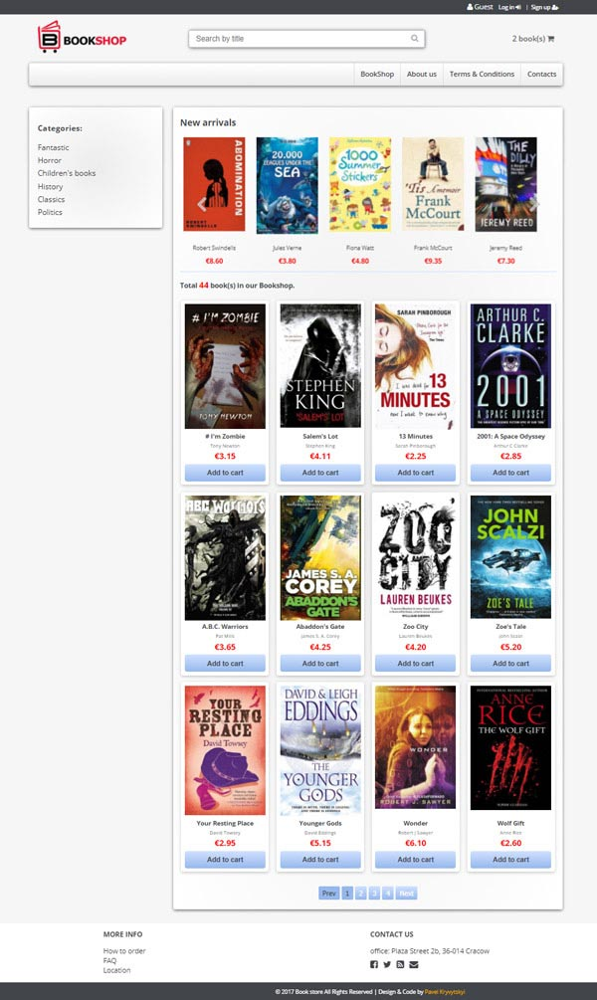
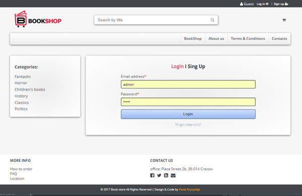
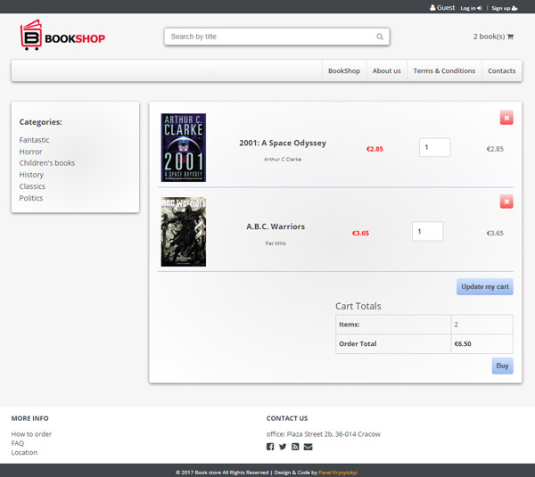

# BookShop PHP project

After learning fundamentals of PHP I decided to implement all my knowledge in one project. Now I'm studying OOP in PHP so this project I will code using functional PHP.
Main idea of this project- to use on practice all I've learned on [Udemy](https://udemy.com), [Linda](https://linda.com), [Treehouse](https://teamtreehouse.com), [Ntschool](https://ntschool.ru) and others.

## User's story:
* You can login like **Admin**
  * Admin can add and del items to/from the catalog;
  * Admin can add users to DataBase;
  * Admin can see and del orders of users;

* You may stay just a **Guest** and:
  * choose books from catalogue by category;
  * see detailed description of the book;
  * add and del books to/from your cart;
  * change quantity of books in your cart;
  * make order by filling in the form;

 I realise my shop is far from ideal and can be improved, but this is just first attempt :-).

## Live demo <http://parfum505.000webhostapp.com/bookshop/>

### Main page

### Login page

### Cart

