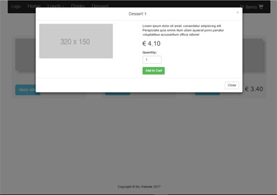

# Recruitment test for position PHP Developer

## Live demo: <http://parfum505.000webhostapp.com/index.php>

## User's story:
* There is a possibility to order lunch or drink;
* There are three cuisines available to order from (Polish, Mexican, Italian);
* Lunch consists of main course and dessert;
* When ordering a drink, customer can additionally ask for ice cubes or/and lemon;
* We must have getPrice() and getName() methods for each meal and drink;

